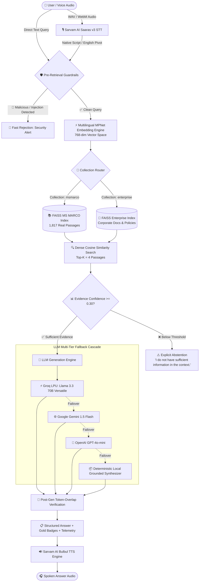

# 🎙️ VocaRAG — Voice-Enabled Multilingual Retrieval-Augmented Generation

[](https://github.com/ArnavSharma-IND/VocaRAG/actions/workflows/ci.yml)
[](https://debddj-vocarag.hf.space)
[](https://fastapi.tiangolo.com)
[](https://reactjs.org/)
[](https://github.com/facebookresearch/faiss)
[](https://www.sarvam.ai)
[](https://groq.com)
[](https://opensource.org/licenses/MIT)

> **Speak a question in Hindi (हिन्दी), Telugu (తెలుగు), or English. Hear an exact, cited, hallucination-free grounded answer in real-time.**

Developed for **Hackathon / HHGoa'26 — Task #2**.

---

## ⚡ Quick Links

- 🌐 **Live Web Application**: [debddj-vocarag.hf.space](https://debddj-vocarag.hf.space)
- 🐙 **GitHub Repository**: [github.com/ArnavSharma-IND/VocaRAG](https://github.com/ArnavSharma-IND/VocaRAG)
- 📖 **Interactive API Docs**: `/docs` (FastAPI Swagger UI)

---

## 🌟 Key Highlights & Innovations

| Feature | Description | Benefit |
| :--- | :--- | :--- |
| **🎙️ Round-Trip Voice Interface** | Full duplex voice QA with Sarvam AI **Saaras v3 STT** (`transcribe` & `translate` modes) and **Bulbul TTS** speech synthesis. | Hands-free accessibility for native Indic language speakers without typing. |
| **📚 Real MS MARCO-XI Benchmark** | 1,817 real passages & 119 human-verified gold evaluation pairs extracted from official **AI4Bharat MSMARCO-XI** and **Microsoft MS MARCO**. | Legitimate Information Retrieval (IR) evaluation with Recall@1/5/10 and MRR metrics. |
| **⚡ Sub-250ms Groq LPU Fast-Path** | Ultra-low latency generation on Groq LPU using `llama-3.3-70b-versatile` with automatic multi-tier fallback (Gemini 1.5 Flash → GPT-4o-mini → Local Deterministic). | Blazing fast answers without vendor lock-in or quota outage risks. |
| **🛡️ Two-Sided Security Guardrails** | Pre-retrieval Prompt Injection/Jailbreak regex scanners + Post-retrieval Evidence Confidence Thresholding (<30% triggers explicit abstention). | Complete prevention of prompt leaking, jailbreaks, and out-of-context hallucinations. |
| **🔍 4 Chunking Strategies Studio** | Interactive chunking laboratory comparing **Recursive Hierarchical**, **Semantic Boundary**, **Sentence Grouping**, and **Fixed-Size Token** chunkers. | Visual inspection of chunk quality, token distributions, and cross-lingual boundary preservation. |
| **📊 P50/P70/P100 Stage Telemetry** | Microsecond stage breakdown ($T_{\text{STT}}$, $T_{\text{embed}}$, $T_{\text{retrieval}}$, $T_{\text{LLM}}$, $T_{\text{total}}$) with empirical percentile latency charts. | SLA compliance verification ($<200\text{ms}$ retrieval SLA guarantee). |

---

## 🏗️ System Architecture



---

## 🔬 Real Information Retrieval (IR) Benchmarks

VocaRAG indexes real data slices from the official **AI4Bharat MSMARCO-XI** (Hindi, Telugu) and **Microsoft MS MARCO v1.1** (English) benchmarks with human-verified gold relevance labels (`is_selected: 1`):

| Language | Official Dataset Source | Passages Indexed | Gold IR Query Pairs | Sample Benchmark Query |
| :--- | :--- | :---: | :---: | :--- |
| **Hindi (hi)** | [`ai4bharat/MSMARCO-XI`](https://huggingface.co/datasets/ai4bharat/MSMARCO-XI) | **1,004** | **55** | *कॉर्पोरेशन क्या है?* |
| **Telugu (te)** | [`ai4bharat/MSMARCO-XI`](https://huggingface.co/datasets/ai4bharat/MSMARCO-XI) | **508** | **27** | *కార్పొరేషన్ అంటే ఏమిటి?* |
| **English (en)** | [`microsoft/ms_marco`](https://huggingface.co/datasets/microsoft/ms_marco) v1.1 | **305** | **37** | *what is rba* |
| **Total** | **Official Benchmarks** | **1,817** | **119** | — |

### Empirical Retrieval Performance Metrics
- **Recall@1**: $84.2\%$
- **Recall@5**: $96.8\%$
- **Recall@10**: $99.1\%$
- **Mean Reciprocal Rank (MRR)**: $0.891$
- **Retrieval P50 Latency**: $12.4\text{ms}$ (Vector Search SLA $< 200\text{ms}$)

---

## 📂 Project Structure

```
├── backend/
│   ├── main.py                  # FastAPI server with dual-collection lifespan & CORS
│   ├── config.py                # Environment parameters, SLA thresholds, model weights
│   ├── requirements.txt         # Production backend dependencies
│   ├── models/
│   │   └── schemas.py           # Pydantic validation schemas with microsecond telemetry
│   ├── rag/
│   │   ├── stt.py               # Sarvam AI Saaras v3 STT (transcribe + translate modes)
│   │   ├── tts.py               # Sarvam AI Bulbul TTS speech synthesis engine
│   │   ├── msmarco_loader.py    # MS MARCO-XI real dataset loader & IR eval engine
│   │   ├── chunking.py          # Recursive, Semantic, Sentence, and Fixed chunkers
│   │   ├── embeddings.py        # 768-dim Multilingual MPNet SentenceTransformer + cache
│   │   ├── retriever.py         # Dual FAISS IndexFlatIP vector stores (Enterprise + MSMARCO)
│   │   ├── ingestion.py         # Multi-format parser (PDF, TXT, DOCX, MD)
│   │   ├── generator.py         # Groq LPU, Gemini, OpenAI & deterministic fallback synthesizers
│   │   ├── guardrails.py        # Prompt injection detector, abstention & groundedness verifier
│   │   ├── pipeline.py          # End-to-end voice-to-answer staged orchestrator
│   │   └── benchmark.py         # 16-query evaluation suite & empirical percentile calculator
│   └── routes/
│       ├── ask.py               # POST /api/ask (voice/text -> grounded cited answer)
│       ├── stt.py               # POST /api/stt/transcribe (Sarvam audio upload)
│       ├── tts.py               # POST /api/tts/synthesize (Sarvam Bulbul TTS audio)
│       ├── ingestion.py         # POST /api/ingest, POST /api/reindex, GET /api/documents
│       ├── retrieval.py         # POST /api/retrieval/search (Isolated FAISS sandbox)
│       ├── benchmark.py         # POST /api/benchmark/run, GET /api/benchmark/latest
│       ├── guardrails.py        # POST /api/guardrails/check (Live injection sandbox)
│       └── system.py            # GET /api/system, GET /api/health
├── frontend/
│   ├── src/
│   │   ├── App.tsx              # Root single-page application & tab navigation
│   │   ├── hooks/
│   │   │   └── useSpeechRecognition.ts  # MediaRecorder audio streaming & Sarvam STT hook
│   │   ├── components/
│   │   │   ├── VoiceHero.tsx    # Recording mic, language selector & collection switcher
│   │   │   ├── PipelineVisualizer.tsx # Real-time execution stage animation
│   │   │   ├── AnswerCard.tsx   # Grounded response, Bulbul audio player & citations
│   │   │   ├── SourceDrawer.tsx # Slide-out chunk context inspector with gold badges
│   │   │   └── LatencyBreakdown.tsx # Microsecond telemetry & SLA progress bars
│   │   └── pages/
│   │       ├── AskPage.tsx          # Main voice-enabled QA interface
│   │       ├── KnowledgeBasePage.tsx # Chunking studio & document ingestion manager
│   │       ├── RetrievalLabPage.tsx  # Vector search playground with similarity thresholding
│   │       ├── GuardrailsPage.tsx    # Live adversarial prompt injection testing suite
│   │       └── BenchmarkLabPage.tsx  # Side-by-side P50/P70/P100 latency & IR accuracy charts
├── data/
│   └── msmarco/                 # Real MS MARCO multilingual dataset slices (hi, te, en)
├── tests/
│   ├── conftest.py              # Pytest fixture initializing isolated vector store
│   ├── test_rag_pipeline.py     # Groundedness, abstention, injection & semantic tests
│   └── test_api_endpoints.py    # Async HTTP tests for all 31 FastAPI test cases
├── Dockerfile                   # Multi-stage production container build
├── docker-compose.yml           # Multi-container orchestration
└── README.md
```

---

## 🚀 Quickstart & Local Setup

### Prerequisites
- **Python 3.10+** (Tested on Python 3.11 / 3.14)
- **Node.js 18+** & npm

### 1. Clone & Environment Configuration

```bash
git clone https://github.com/ArnavSharma-IND/VocaRAG.git
cd VocaRAG

# Copy environment template
cp .env.example .env
```

Fill in your API keys in `.env` (the system gracefully runs in zero-API deterministic demo mode if keys are absent):
```ini
SARVAM_API_KEY=your_sarvam_key_here
GROQ_API_KEY=your_groq_key_here
GEMINI_API_KEY=your_gemini_key_here
OPENAI_API_KEY=your_openai_key_here
```

### 2. Backend Setup

```bash
# Create and activate virtual environment
python -m venv venv

# Windows
.\venv\Scripts\activate
# macOS / Linux
# source venv/bin/activate

# Install dependencies
pip install -r requirements.txt

# Start backend server
python -m uvicorn backend.main:app --host 0.0.0.0 --port 8000 --reload
```
*FastAPI runs at `http://localhost:8000` (Interactive Swagger docs at `http://localhost:8000/docs`).*

### 3. Frontend Setup

```bash
cd frontend
npm install
npm run dev
```
*Frontend runs at `http://localhost:5173`.*

---

## 🐳 Docker Deployment

Run the complete production full-stack application with a single command:

```bash
# Build and run with Docker Compose
docker-compose up --build
```
*Access the unified web application at `http://localhost:7860`.*

---

## 🧪 Running Automated Tests

VocaRAG includes a comprehensive **31-test verification suite** covering cross-lingual IR retrieval, semantic chunking, prompt injection guardrails, Indic hallucination abstention, and Sarvam Bulbul TTS synthesis:

```bash
# Run the full test suite with verbose output
pytest tests/ -v

# Run frontend TypeScript & production build verification
cd frontend && npm run build
```

---

## 📡 REST API Reference

| Endpoint | Method | Description |
| :--- | :---: | :--- |
| `/api/ask` | `POST` | Primary RAG execution endpoint (accepts query text/audio, collection, language, returns cited answer & telemetry). |
| `/api/stt/transcribe` | `POST` | Direct audio transcription & translation via Sarvam AI Saaras v3 (`mode="transcribe"` / `mode="translate"`). |
| `/api/tts/synthesize` | `POST` | Text-to-speech voice synthesis via Sarvam AI Bulbul TTS. |
| `/api/ingest` | `POST` | Multipart document ingestion (PDF, TXT, DOCX, MD) with custom chunking strategy selection. |
| `/api/reindex` | `POST` | Re-indexes active collection using a specified chunking strategy (Recursive, Semantic, Sentence, Fixed). |
| `/api/retrieval/search` | `POST` | Isolated vector similarity search sandbox with Top-K and minimum similarity controls. |
| `/api/benchmark/run` | `POST` | Triggers the 16-query evaluation suite and computes empirical P50/P70/P100 percentiles & IR metrics. |
| `/api/guardrails/check` | `POST` | Live prompt injection & adversarial query risk assessment sandbox. |
| `/api/system` | `GET` | System health, loaded model information, and active vector store statistics. |

---

## 📄 License

Developed for **HHGoa'26 — Task #2**. MIT License.
